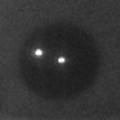
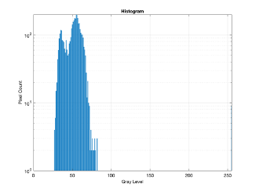
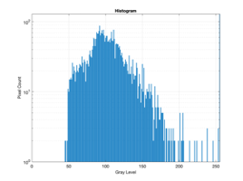
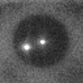
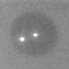
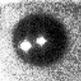
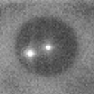
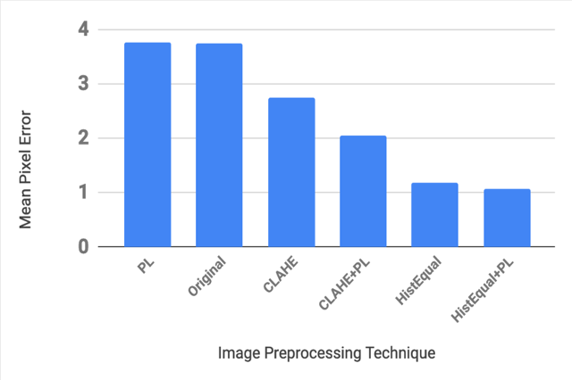

# Pupil Center Estimation

This repository explores CNN-based pupil center estimation from infrared eye images captured with a smartphone-based head tracker.

The project focuses on estimating pupil center coordinates from eye images and comparing how different image-enhancement techniques affect localization error.

## Model Overview

The CNN architecture uses:

- Five convolutional layers with 3x3 filters and stride 1
- Average pooling with 2x2 windows and stride 2
- Batch normalization and dropout after each layer
- One fully connected layer with 2048 units
- Euclidean distance between true and predicted pupil centers as the loss function

## Image Enhancement Experiments

The project compares several preprocessing approaches:

- Histogram equalization
- Power-law transformation
- Adaptive histogram equalization
- Adaptive histogram equalization combined with power-law transformation

## Example Inputs

Raw infrared eye image and histogram examples:

 

 

## Enhancement Results

Adaptive histogram equalization:

Power-law transformation:

Histogram equalization:

Adaptive histogram equalization plus power-law transformation:

## Evaluation

Mean pixel error after training with different enhancement techniques:

